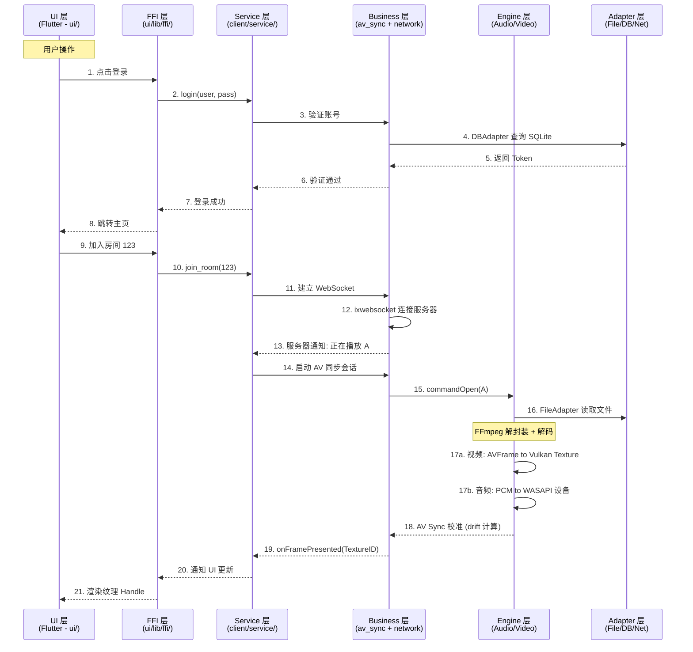
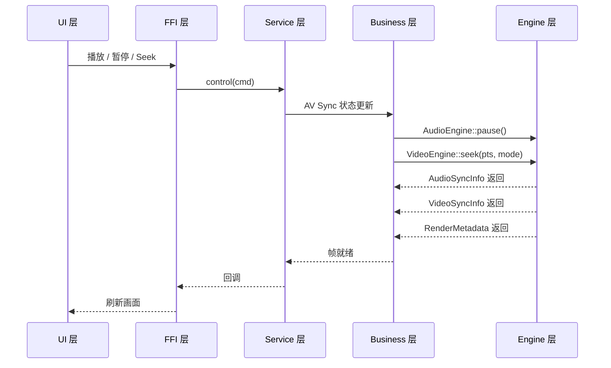
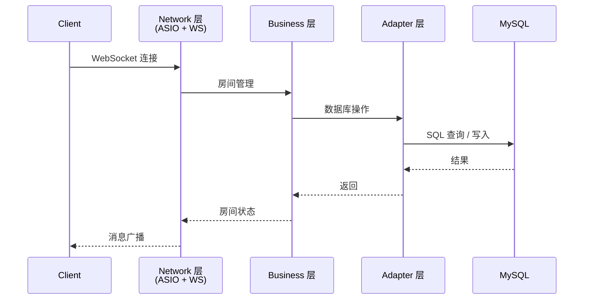

# PrismPlayer 数据流文档

> 基于项目实际架构，最后更新：2026-10-09
>
> **本文档描述的是「数据应当怎么流」，不是「数据现在真的在流」。** 下列每条链路都标注了实测状态（✅ 已落地 / 🟡 仅骨架 / ⛔ 未开始）。实现状态的完整汇总见 `项目计划书.md` §11；术语以根目录 `GLOSSARY.md` 为准。
>
> 修复说明：本文档此前含有 5 个非法控制字符（0x07 BEL / 0x0B VT / 0x0C FF），来自未转义的 `\a` / `\v` / `\f` 转义序列，破坏了反引号 code span —— 把 `async_decode()`、`restart()`、`flush()`、`` `ffmpeg` ``、`` `vulkan` ``、`` `nlohmann-json` ``、`` `asio` `` 啃掉了首字符（`\restart()` 曾显示成 `estart()`）。已全部清除。

---

## 1. 整体数据流向

项目采用分层架构，数据从 UI 层逐层向下传递到 Engine 层处理，结果逐层向上回调。

**这条链路哪一段是真的**：

| 步骤 | 环节 | 状态 | 依据 |
|---|---|---|---|
| 1–2、9–10、20–21 | UI ↔ FFI ↔ Service 的调用 | 🟡 一半 | C++ 侧 32 个 C API 已导出（`client/service/src/Player.cpp:135-572`）；Dart 侧 `ui/lib/ffi/ffi_bridge.dart` 只有 17 行、无 `lookupFunction`，且无人 import |
| 3–8 | 账号认证与数据库查询 | ⛔ | `client-network` 是 0 字节；`SQLiteDBAdapter` 只有声明（`internal/SQLiteDBAdapter.h:40` 还是 `// TODO`）；`sqlite3` 未声明依赖 |
| 11–13 | WebSocket 信令 | ⛔ | `ISignalingClient.h` 有接口，`internal/NetImpl.h` 与 `src/tmp.cpp` 均 0 字节 |
| 14–15、18–19 | AV Sync 会话与漂移计算 | ✅ | `client/business/av_sync/src/` 323 行；`CommandDispatcher.cpp:1-130` 负责下发，`EngineObserver.cpp:1-58` 接收帧状态 |
| 16 | FileAdapter 读文件 | ⛔ | `client/adapter/src/tmp.cpp` 是 0 字节 |
| 17a / 17b | 解码 + 渲染 + 音频输出 | ⛔ | `client/engine/src/` 下无任何 FFmpeg 源文件；`VideoEngineVulkan.cpp` 32 行、`AudioEngineWasapiShared.cpp` 29 行，均无真实调用 |

> ⚠️ 换言之：**这条主链路上真正跑得通的只有中间 14–15、18–19 这一段（AV Sync）**，两端（UI/FFI 与 Engine/Adapter/Network）都还是空的。

---

## 2. 播放控制数据流

**状态**：⛔ 端到端未跑通。`BIZ → ENG` 这一段依赖引擎返回 `AudioSyncInfo` / `VideoSyncInfo` / `RenderMetadata`，而引擎层只有 75 行骨架，**这三个返回值都还产生不出来**。AV Sync 内部的状态机与命令分发本身是 ✅ 的（见 §1 表）。

---

## 3. Server 端数据流

**状态**：⛔ 全部未实现。`server/main.cpp` 只有 3 行 `int main(){ return 0; }`；`server/{adapter,business,network}/` 下只有 0 字节的 `tmp.h` / `tmp.cpp`；MySQL 客户端依赖在 `vcpkg.json` 里不存在。表结构与查询要求见 `项目计划书.md` §9（含 E-R 图）。

---

## 4. 层级职责一览

| 层级 | 目录 | 状态 | 职责 |
|------|------|------|------|
| **UI 层** | `ui/` | 🟡 Flutter 脚手架已初始化，页面未开发（`ui/lib/main.dart` 仍是计数器模板） | Flutter 界面、用户交互 |
| **FFI 层** | `ui/lib/ffi/` | 🟡 `ffi_bridge.dart` 仅 17 行，只做动态库加载 | Dart to C++ 桥接 |
| **Service 层** | `client/service/` | ✅ C API 完整实现（**32 个** API，`Player.cpp` 448 行） | API 门面，组合业务功能 |
| **Business 层** | `client/business/` | ✅ AV Sync 完整实现（323 行） + ⛔ Network 占位（接口已定义，无实现） | AV 同步算法、网络通信 |
| **Engine 层** | `client/engine/` | 🟡 抽象接口 + 工厂骨架（共 75 行），无解码实现 | FFmpeg 解码 + Vulkan/WASAPI 渲染 |
| **Adapter 层** | `client/adapter/` | 🟡 接口与实现头文件齐备，全部只有声明；`src/tmp.cpp` 0 字节 | 文件/数据库/网络基础设施 |

> ⚠️ 两处修正：旧表把 Service 层写成「**27 个** API」，实测是 **32 个**；另外旧表的目录列里混进了反斜杠转义（写成 `client/service/\`），已清掉。

---

## 5. 核心接口速查

### 5.1 Engine 层（`client/engine/include/`）

| 接口 | 头文件 | 关键方法 |
|------|--------|----------|
| `AudioEngine` | `client/engine/include/AudioEngine.h` | `init()`, `play()`, `pause()`, `close()`, `set_play_speed()`, `seek(pts, mode)`, `get_sync_info()` |
| `VideoEngine` | `client/engine/include/VideoEngine.h` | `init()`, `play()`, `pause()`, `close()`, `set_play_speed(float)`, `seek(pts, mode)`, `get_sync_info()`, `get_render_result()` |
| `AudioEngineFactory` | `client/engine/include/AudioEngineFactory.h` | `create_audio_engine()` |
| `VideoEngineFactory` | `client/engine/include/VideoEngineFactory.h` | `create_video_engine()` |

### 5.2 `practice/AudioDecoder`（试验代码，**未被 git 跟踪、不在构建中**）

`practice/AudioDecoder.h`（133 行）是 FFmpeg 音频解码器的接口设计稿，抽象类 `AudioDecoder` 有 **11 个**纯虚方法：

| # | 方法 | 说明 |
|---|---|---|
| 1 | `init(const audio_decoder_config& config)` | 初始化 |
| 2 | `sync_decode()` | 同步解码 |
| 3 | `async_decode()` | 异步解码 |
| 4 | `restart()` | 停止状态下重启 |
| 5 | `stop()` | 停止正在工作的解码器 |
| 6 | `flush()` | 清除解码器缓存 |
| 7 | `reset()` | 重置为初始状态 |
| 8 | `free()` | 释放资源 |
| 9 | `isRunning()` | 是否在运行 |
| 10 | `get_config_info() const` | 取配置信息 |
| 11 | `get_status_info() const` | 取状态信息 |

配套类型：`enum class sync_state` 7 态（`UNINIT` / `CALIBATING` / `SYNCHRONIZED` / `AHEAD` / `BEHIND` / `DISABLE` / `ERROR`）、`struct audio_decoder_config`（`codec_id` / `bit_rate` / `sample_rate` / `channels` / `channel_layout` / `sample_fmt`）。

> ⚠️ 旧表把它写成「**9 个**虚方法」并列举为 `` `init()`, `sync_decode()`, \async_decode(), estart(), `stop()`, \flush()\ `` —— 数字错（是 11），且因为控制字符，`async_decode()` 与 `flush()` 被吃掉首字符、`restart()` 变成 `estart()`。上表是逐个核对源码后的结果。
>
> ⚠️ 另外注意 `sync_state` 是**音频解码器**的状态机，与 AV Sync 模块的 `SyncState`（`client/business/av_sync/include/SyncTypes.h`）不是同一个东西，见 `GLOSSARY.md`。
>
> ⚠️ 这个设计稿本身有编译级缺陷：`get_status_info()` 的返回类型 `audio_decoder_info` 全仓无定义；第 133 行收尾注释写成 `} // namespace Prism::engine`（第 5 行实际是 `Prism::Engine`）；`isRunning()` 违反 `代码规范.md` §1.2 的 snake_case。

### 5.3 AV Sync（`client/business/av_sync/include/`）

| 接口 | 头文件 | 角色 |
|------|--------|------|
| `ISyncAlgorithm` | `include/ISyncAlgorithm.h` | 按 `drift` 判定 `SyncAction`（`WAIT` / `DROP` / `RENDER`） |
| `ICommandDispatcher` | `include/ICommandDispatcher.h` | 向 Engine 层下发播放指令 |
| `IPlaybackStateMachine` | `include/IPlaybackStateMachine.h` | 播放/暂停/停止/Seek 状态转换 |
| `IEngineObserver` | `include/IEngineObserver.h` | 接收 Engine 层回传的帧状态 |
| `SyncFactory` | `include/SyncFactory.h` | 组装上述四者 |
| `SyncTypes` | `include/SyncTypes.h` | 公共类型（`SyncState` / `SyncAction` 等） |

### 5.4 Service 层（`client/service/include/`）

| 头文件 | 内容 |
|--------|------|
| `Player.h`（253 行） | **32 个** C API（`_API` 宏出现 32 次），完整清单见 `API接口文档.md` |
| `Types.h`（125 行） | `PrismPlayerHandle` / `PrismConfig` / `PrismLoginParams` / `PrismRoomInfo` / `PrismEventCallback` / `PRISM_OK` / `PRISM_ERROR_NETWORK` 等 |

---

## 6. 依赖库数据流角色

「状态」列口径与 `项目计划书.md` §4 一致。

| 依赖库 | 所在层 | 数据流中的用途 | 状态 |
|--------|--------|----------------|------|
| `spdlog` | 全局 | 各层关键逻辑的日志输出 | ✅ 已使用（5 个 `.cpp` include 了它） |
| `ffmpeg` | Engine | 解封装（Demuxer）、视频解码、音频解码 | 🟡 已接线未使用 |
| `soundtouch` | Engine | 音频变速变调（在 PCM 之后、WASAPI 之前） | 🟡 已接线未使用 |
| `vulkan` | Engine | 视频纹理上传与渲染 | 🟡 已接线未使用 |
| `glfw3` | Engine | 窗口管理与渲染目标 | 🟡 已接线未使用 |
| `glm` | Engine | 渲染管线数学运算 | 📐 已声明未接线 |
| `asio` | Business (Network) | 异步网络 I/O（HTTP、计划中的 P2P） | 🟡 已接线未使用 |
| `ixwebsocket` | Business (Network) | WebSocket 信令通道 | 🟡 已接线未使用 |
| `nlohmann-json` | Business (Network) | 信令消息的 JSON 编解码 | 🟡 已接线未使用 |
| `openssl` | Adapter | 密码哈希、TLS、文件传输加密（计划） | 📐 已声明未接线 |
| `sqlite3` | Adapter | 客户端本地库（账号、媒体文件、设置） | ⛔ 计划内未声明（`vcpkg.json` 里没有） |
| `gtest` | `test/` | 单元测试 | 📐 已声明未接线（全仓无 `find_package(GTest)`） |
| `libplacebo` | Engine | 视频后处理 / HDR（计划） | ⛔ 计划内未声明 |

> ⚠️ 旧表三处归属错误已修正：
> 1. `nlohmann-json` 标的是 **Adapter**「JSON 配置解析」，但实际 `find_package(nlohmann_json)` 在 `client/business/network/CMakeLists.txt:6`，属于 **Business (Network)**，用途是信令消息编解码；
> 2. `asio` 与 `ixwebsocket` 的「所在层」写对了，但漏了 `ffmpeg` / `vulkan` / `glfw3` / `soundtouch` 都只是**接线未使用**这一事实；
> 3. 表中缺 `glm`、`openssl`、`sqlite3`、`gtest`、`libplacebo` 的状态，容易被读成「都已就绪」。
>
> ⚠️ 旧表四处行首的反斜杠（`fmpeg\`、`ulkan\`、`sio\`、`lohmann-json\`）就是控制字符吃掉 `` `f `` / `` `v `` / `` `a `` / `` `n `` 之后的残迹，已修正为正确的反引号 code span。
