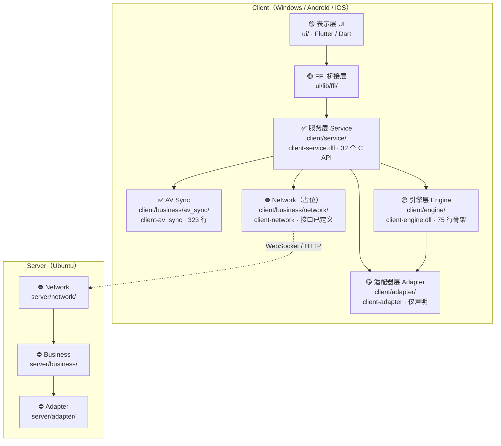
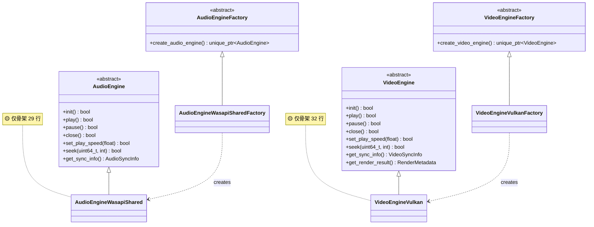

# PrismPlayer 项目架构文档

> 基于项目实际代码，最后更新：2026-10-09
>
> **本文档描述「架构与各模块职责」，不是实现进度表。** 每节标注了实测状态（✅ 已落地 / 🟡 仅骨架 / 📐 仅设计 / ⛔ 未开始）；完整的实现状态与证据汇总见 `项目计划书.md` §11。文件目录树见 `项目计划书.md` §7。术语以根目录 `GLOSSARY.md` 为准。

---

## 1. 总体架构

项目分为 **Client**（客户端）和 **Server**（服务端）两大部分，Client 内部采用六层分层架构。

图例：✅ 已落地 / 🟡 仅骨架 / ⛔ 未开始

> **六层的实际形态并不对称**：真正有实现的是**服务层**（`Player.cpp` 448 行）与**业务层的 AV Sync 子模块**（323 行）；引擎层与适配器层只有声明骨架；Network 与整个 Server 端是 0 字节。
>
> 旧版本节只有一张纯文本 ASCII 图，看不出哪些层是真的。现在改成上图，并把状态标在节点里。

**层间依赖与目标形态**（`docs/adr/0001-分层架构与库形态.md`）：

| CMake 目标 | 形态 | 层 |
|---|---|---|
| `client-adapter` | `STATIC` | Adapter |
| `client-engine` | `SHARED` | Engine |
| `client-av_sync` | `STATIC` | Business（AV Sync） |
| `client-network` | `STATIC` | Business（Network） |
| `client-service` | `SHARED` | Service |
| `Prism-server` | `EXECUTABLE` | Server |

> ⚠️ 旧版本节没有列这些名字；而 §7 曾把主目标错写成不存在的 `Prism-client`。真实目标就是上表 6 个。

---

## 2. Client 分层详解

### 2.1 UI 层 — `ui/` (Flutter 项目)

| 组件 | 说明 | 状态 |
|------|------|------|
| Login Page | 用户登录/注册界面 | ⛔ |
| Room List | 房间列表，浏览和加入房间 | ⛔ |
| Player UI | 播放器主界面，视频渲染区域 + 控制栏 | ⛔ |
| File Sharing UI | 文件分享界面 | ⛔ |

- **开发语言**：Dart + Flutter (3.44.0)
- **当前状态**：🟡 Flutter 项目已初始化（含 Android/iOS/Windows/macOS/Linux/Web 全平台脚手架），但 `ui/lib/main.dart` 111 行**仍是官方计数器模板**（`MyApp` / `MyHomePage` / `_counter`），**上面四个页面一个都没有**；`ui/lib/gui/tmp.dart` 是 0 字节
- **负责人**：@Rikka2-aa

### 2.2 FFI 层 — `ui/lib/ffi/`

Dart 与 C++ 之间的桥接层，设计上包含三件事：

| 设计要素 | 说明 | 状态 |
|---|---|---|
| Dart FFI Bindings | Dart 侧调用 C ABI 导出函数（`lookupFunction` + typedef） | ⛔ 未实现 |
| C 函数导出 | C++ 侧通过 `extern "C"` 暴露接口 | ✅ 已存在（在 C++ 侧） |
| Dart Isolate 通信 | 避免阻塞 UI 线程 | ⛔ 未实现 |

- **当前状态**：🟡 `ui/lib/ffi/ffi_bridge.dart` **只有 17 行**，内容仅 `class FFIBridge { static DynamicLibrary loadLibrary() }`（Windows 下拼 `../../../build/client/service/libclient-service.dll`）——**没有 `lookupFunction`、没有 typedef、没有结构体映射、没有 Isolate**，而且 `ui/lib` 里**没有任何文件 import 它**。
- **C++ 侧是好的**：`client/service/include/Player.h` + `client/service/src/Player.cpp:135-572` 的 `extern "C"`（配合 `client/common/API.h` 的 `_API` 宏）已经把 32 个 C API 导出，ABI 是现成的，缺的只是 Dart 侧的绑定代码。

### 2.3 Service 层 — `client/service/`

API 门面层，将 Business 层的原子功能组合为面向外部的统一接口。

| 职责 | 说明 |
|------|------|
| 对外 API | 供 UI 层（通过 FFI）和二次开发调用 |
| 功能组合 | 将 AV Sync、网络通信组合为场景化接口 |
| 依赖 | `client-av_sync`、`client-network` |

- **构建产物**：动态库 (`client-service`)
- **当前状态**：✅ **完整实现** —— `Player.h` 253 行（**32 个** C API，`_API` 宏出现 32 次，与 `Player.cpp` 的 32 个定义一一对应）+ `Types.h` 125 行完整类型系统 + `PlayerImpl.h` 58 行内部实现 + `IServiceNetwork.h` 51 行网络抽象（当前挂着默认桩实现）+ `Player.cpp` 448 行
- **负责人**：@RickeyDeung（AV Sync）+ @ambulance001（Network）

> ⚠️ 旧版这里写「Player.h **27 个** C API」—— 数字错了，实测是 **32** 个。已在 `项目计划书.md`、`API接口文档.md` 同步修正。

### 2.4 Business 层 — `client/business/`

业务逻辑核心，分为两个子模块。

#### Module A: AV Sync（音视频同步）

| 组件 | 源文件 | 行数 | 说明 |
|------|--------|------|------|
| `SyncAlgorithm` | `src/SyncAlgorithm.cpp` | 47 | 音视频同步算法：`drift = video_pts - audio_pts`，超 `ahead_threshold_ms` → `WAIT`、低于 `-behind_threshold_ms` → `DROP`、否则 `RENDER` |
| `CommandDispatcher` | `src/CommandDispatcher.cpp` | 130 | 向 Engine 层发送播放指令（**全模块最大，且没有任何旧测试覆盖**） |
| `PlaybackStateMachine` | `src/PlaybackStateMachine.cpp` | 65 | 播放状态机（播放/暂停/停止/Seek） |
| `EngineObserver` | `src/EngineObserver.cpp` | 58 | 接收 Engine 层回传的帧状态 |
| `SyncFactory` | `src/SyncFactory.cpp` | 23 | 组装上述四者 |

- **接口头**：`include/` 下 `ISyncAlgorithm.h` / `ICommandDispatcher.h` / `IPlaybackStateMachine.h` / `IEngineObserver.h` / `SyncFactory.h` / `SyncTypes.h`
- **依赖**：Engine 层接口
- **当前状态**：✅ **已落地，共 323 行** —— 全仓第二大实现，也是唯一被单元测试覆盖过的模块（测试在 `f9ddd15` 被删，恢复计划见 #54）
- **负责人**：@RickeyDeung

#### Module B: Network（网络通信）

| 组件 | 头文件 | 行数 | 说明 |
|------|--------|------|------|
| `ISignalingClient` | `include/ISignalingClient.h` | 40 | WebSocket 信令客户端（计划用 ixwebsocket） |
| `IRoomManager` | `include/IRoomManager.h` | 42 | 房间加入/离开管理 |
| `IAccountManager` | `include/IAccountManager.h` | 39 | 账号认证管理 |
| `INetworkObserver` | `include/INetworkObserver.h` | 41 | 网络事件回调 |
| `NetworkFactory` | `include/NetworkFactory.h` | 22 | 工厂 |
| `NetworkTypes` | `include/NetworkTypes.h` | 65 | 公共类型 |

- **依赖**：ASIO、ixwebsocket（`client/business/network/CMakeLists.txt:5-7` 已 `find_package`，但无源码 include）
- **当前状态**：⛔ **占位（接口已定义，无实现）** —— 上表 6 个头文件是真的，但 `internal/NetImpl.h` 与 `src/tmp.cpp` 都是 **0 字节**，编译产物 `build/client/business/network/libclient-network.a` 是 **832 B 空归档**
- **负责人**：@ambulance001

> ⚠️ 旧版这里列的 5 个组件（`SignalingClient` / `RoomManager` / `AccountManager` / `FileTransferManager` / `P2PConnectionManager`）**后两个在磁盘上根本不存在**，前三个的接口名也不对（本仓库接口一律带 `I` 前缀）；同时旧版漏掉了实有的 `INetworkObserver` / `NetworkFactory` / `NetworkTypes`。已按 `include/` 下的实际文件重列。

### 2.5 Engine 层 — `client/engine/`

使用工厂模式创建平台特定的音视频引擎：

| 模块 | 库/技术 | 说明 | 状态 |
|------|---------|------|------|
| FFmpeg 模块 | FFmpeg | 解封装 (Demuxer)、视频解码、音频解码 | ⛔ 无源文件 |
| Vulkan 模块 | Vulkan SDK, GLFW, GLM | 渲染管线、纹理上传、Draw Calls | 🟡 32 行骨架 |
| Audio 模块 | WASAPI (Windows), SoundTouch | PCM 音频输出、变速变调 | 🟡 29 行骨架 |
| 计划扩展 | AAudio (Android), AudioUnit (iOS) | 跨平台音频 | 📐 仅设计 |

**核心类关系**：

| 接口 | 头文件 | 关键方法 |
|------|--------|----------|
| `AudioEngine` | `client/engine/include/AudioEngine.h` | `init()`, `play()`, `pause()`, `close()`, `set_play_speed()`, `seek()`, `get_sync_info()` |
| `VideoEngine` | `client/engine/include/VideoEngine.h` | `init()`, `play()`, `pause()`, `close()`, `set_play_speed(float)`, `seek()`, `get_sync_info()`, `get_render_result()` |
| `AudioEngineFactory` | `client/engine/include/AudioEngineFactory.h` | `create_audio_engine()` |
| `VideoEngineFactory` | `client/engine/include/VideoEngineFactory.h` | `create_video_engine()` |

- **构建产物**：动态库 (`client-engine`)
- **当前状态**：🟡 **仅骨架** —— 抽象接口与工厂已定义，但 `src/` 下只有 4 个 `.cpp` 共 **75 行**（`AudioEngineWasapiShared.cpp` 29 + `AudioEngineWasapiSharedFactory.cpp` 7 + `VideoEngineVulkan.cpp` 32 + `VideoEngineVulkanFactory.cpp` 7）。**没有真实的 WASAPI 调用、没有 Vulkan 初始化/交换链/纹理上传、`src/` 下没有任何 FFmpeg 源文件。**
- **负责人**：@xiaofusu123（解码）、整体架构

> ⚠️ 旧版本节标题写着 **【最完善层】** —— 这个标签是错的。引擎层的实际代码量（75 行）比业务层的 AV Sync（323 行）少一个数量级，比服务层（448 行）少近六倍。**真正最完善的是服务层。** 该说法来自更早的设计预期，已按实测删去。

### 2.6 Adapter 层 — `client/adapter/`

基础设施静态库，为上层提供平台抽象。**`include/` 放抽象接口，`internal/` 放平台实现**：

| 抽象接口（`include/`） | 平台实现（`internal/`） | 用途 |
|--------|--------|------|
| `FileAdapter` | `WinFileAdapter` | 本地文件读写 (MP4, MKV, MP3, FLAC 等) |
| `DBAdapter` | `SQLiteDBAdapter` | SQLite 数据库操作 |
| `NetworkAdapter` | `ASIONetworkAdapter` | HTTP / WebSocket 网络请求 |
| `ConfigAdapter` | `JSONConfigAdapter` | JSON 配置文件读写 |
| `CryptoAdapter` | `OpenSSLCryptoAdapter` | 密码哈希 (OpenSSL) |

- **构建产物**：静态库 (`client-adapter`)
- **当前状态**：🟡 **仅骨架** —— 上表 10 个头文件都只有类声明，`src/tmp.cpp` 是 **0 字节**（该模块唯一的 `.cpp`），编译产物 `libclient-adapter.a` 是 **832 B 空归档**。两处 `// TODO`：`internal/OpenSSLCryptoAdapter.h:36`（添加 OpenSSL 相关私有成员）、`internal/SQLiteDBAdapter.h:40`（添加 `sqlite3*` 数据库句柄等私有成员）。
- **负责人**：@kuailede110

> ⚠️ 旧版只列了 5 个接口名，看不出「接口 + 实现」两层结构，容易被读成「有 5 个实现」。完整对照表见根目录 `GLOSSARY.md`。

---

## 3. Server 架构 — `Prism-server`

目标运行平台：**Ubuntu (Linux)**

| 层级 | 目录 | 职责 | 状态 |
|------|------|------|------|
| Network | `server/network/` | WebSocket 服务端、HTTP API (ASIO + ixwebsocket) | ⛔ 0 字节 |
| Business | `server/business/` | 房间管理、用户认证、消息转发 | ⛔ 0 字节 |
| Adapter | `server/adapter/` | MySQL 数据库操作、文件存储、配置管理 | ⛔ 0 字节 |

- **当前状态**：⛔ **一行逻辑都没有** —— `server/main.cpp` 只有 3 行 `int main(){ return 0; }`；三个子目录里各只有 `include/tmp.h`、`internal/tmp.h`、`src/tmp.cpp` 三个 **0 字节** 文件。三个层的 `target_link_libraries` 指向 `server-adapter` / `server-network` / `server-business`，但对应的 `.a` 全是 **832 B 空归档**。
- **两个必须先修的坑**（见 #52）：
  1. `server/{adapter,business,network}/` 的 CMake 文件名是**小写 `m` 的 `CmakeLists.txt`** —— 在 Ubuntu 上 `add_subdirectory()` 直接找不到文件。Server 端的目标平台就是 Ubuntu，本机 Windows 永远测不出来。
  2. MySQL 客户端依赖在 `vcpkg.json` 里**不存在**，「MySQL 数据库操作」目前无从实现。
- **负责人**：@xiaofusu123

---

## 4. Vendor 自定义库

| 库 | 路径 | 说明 | 状态 |
|----|------|------|------|
| **ThreadPool** | `vendor/threadpool/` | 动态伸缩线程池，min~max 可配置，含 TaskQueue | ✅ **已落地**：`include/ThreadPool.h` 87 行 + `src/ThreadPool.cpp` 109 行 |
| **MemoryPool** | `vendor/memorypool/` | 内存池管理 | ⛔ **空壳，待删除**：`src/MemoryPool.cpp` 0 字节，`include/MemoryPool.h` 只有 5 行且内容为 `namespace ThreadPool { class Task {}; }`（命名空间写错） |

**`vendor/threadpool/test/`** 是仓库里**唯一有完整 GTest 测试的地方**：

| 文件 | 行数 |
|---|---|
| `test/common.hpp` | 75 |
| `test/benchmark_test.cpp` | 103 |
| `test/load_test.cpp` | 102 |
| `test/stress_test.cpp` | 101 |

三个测试程序各自链 `ThreadPool_static`，用 `enable_testing()` + `add_test()` 注册。

> ⚠️ **但 `vendor/` 从未被纳入根构建。** 根 `CMakeLists.txt` 只有 `add_subdirectory(client)` 与 `add_subdirectory(server)`，`build/` 下连 `vendor/` 目录都没有 —— 上面这套测试**一次都没有跑过**。
>
> ⚠️ 旧版这里写 MemoryPool「支持静态库/动态库构建」，指的是 `MemoryPool_static` / `MemoryPool_shared` 这对 CMake target —— 那对 target 确实存在，但**源码不存在**，一旦 `add_subdirectory(vendor)` 就会因为 `aux_source_directory` 取不到源文件而直接 configure 失败。
>
> ⚠️ 旧版完全没提 `vendor/threadpool/测试报告.md` 与那 3 个测试程序。
>
> 处置决定：`vendor/` 加入根构建、MemoryPool 删除，见 `docs/adr/0001-分层架构与库形态.md` 与 #52 / #53。

---

## 5. Practice 试验代码

| 文件 | 说明 |
|------|------|
| `practice/AudioDecoder.h` | FFmpeg 音频解码器接口设计（**133 行纯设计稿**）：`enum class sync_state` 7 态（`UNINIT`/`CALIBATING`/`SYNCHRONIZED`/`AHEAD`/`BEHIND`/`DISABLE`/`ERROR`）、`struct audio_decoder_config`（6 个成员）、抽象类 `AudioDecoder` 的 **11 个纯虚方法** |
| `practice/pcm_player.cpp` | PCM 音频播放器（**0 字节**） |

`AudioDecoder` 的 11 个纯虚方法：

| # | 方法 |
|---|---|
| 1 | `init(const audio_decoder_config& config)` |
| 2 | `sync_decode()` |
| 3 | `async_decode()` |
| 4 | `restart()` |
| 5 | `stop()` |
| 6 | `flush()` |
| 7 | `reset()` |
| 8 | `free()` |
| 9 | `isRunning()` |
| 10 | `get_config_info() const` |
| 11 | `get_status_info() const` |

> ⚠️ 旧版写「9 个虚方法」，实测是 **11 个**（上表）；旧版也没写出是哪些，导致后来的文档把方法名记成了 `estart()`（`restart()` 被吞掉首字符）。这里逐个列出。
>
> ⚠️ **`practice/` 整个目录被 `.gitignore` 第 2 行忽略** —— 它**不在版本控制里，也不在构建里**（`git log -- practice/` 无任何提交）。所以上表内容是「本机磁盘存在的试验代码」，不是「仓库的一部分」。
>
> ⚠️ 这个文件还有几处**编译级缺陷**，如果将来真要把它变成正式实现，必须先修：
> - 第 130 行 `get_status_info()` 的返回类型 **`audio_decoder_info` 全仓无定义**；
> - 第 5 行是 `namespace Prism::Engine`，而第 133 行的收尾注释写 `} // namespace Prism::engine`（大小写不符，仅注释错误，但会误导）；
> - 第 35 行 `}state;` 把枚举实例声明挤在收尾大括号后，缩进也错乱；
> - 第 120 行 `isRunning()` 是 camelCase，违反 `代码规范.md` §1.2；
> - `audio_decoder_config` 的成员未按 §4.5 做内部初始化。

---

## 6. 依赖项总览

「状态」列口径与 `项目计划书.md` §4 一致：**已使用** / **已接线未使用**（有 `find_package` 无 `#include`）/ **已声明未接线**（只在 `vcpkg.json`）/ **计划内未声明**。

| 类别 | 库 | 用途 | 状态 |
|------|-----|------|------|
| 工具 | `spdlog` | 日志输出 | ✅ 已使用 |
| 音视频 | `ffmpeg` | 解封装、编解码 | 🟡 已接线未使用 |
| 音视频 | `soundtouch` | 音频变速变调 | 🟡 已接线未使用 |
| 渲染 | `vulkan` | GPU 渲染管线 | 🟡 已接线未使用 |
| 渲染 | `glfw3` | 跨平台窗口管理 | 🟡 已接线未使用 |
| 网络 | `asio` | 异步网络 I/O | 🟡 已接线未使用 |
| 网络 | `ixwebsocket` | WebSocket 客户端 | 🟡 已接线未使用 |
| 数据 | `nlohmann-json` | JSON 解析 | 🟡 已接线未使用 |
| 渲染 | `glm` | 数学库 | 📐 已声明未接线 |
| 数据 | `openssl` | 加密/哈希 | 📐 已声明未接线 |
| 工具 | `gtest` | 单元测试框架 | 📐 已声明未接线 |
| 数据 | `sqlite3` | 本地数据库 | ⛔ **计划内未声明**（`vcpkg.json` 里没有） |
| 音视频 | `libplacebo` | 视频后处理（计划中） | ⛔ **计划内未声明** |

`vcpkg.json` 的 features：`client`（asio / ffmpeg / glfw3 / glm / ixwebsocket / nlohmann-json / openssl / soundtouch / spdlog / vulkan）、`server`（asio / ixwebsocket / nlohmann-json / openssl / spdlog）、`test`（gtest）。`default-features` 为 `["client"]`。

---

## 7. 构建系统

| 项目 | 说明 |
|------|------|
| 构建工具 | CMake（`CMakePresets.json` 为 version 10 格式）+ Ninja |
| 编译器 | Clang (C17 / C++17)，经 `CMAKE_C_COMPILER_TARGET=x86_64-w64-mingw32` 交叉到 MinGW |
| 包管理器 | vcpkg，triplet 固定 `x64-mingw-dynamic`，二进制缓存走仓库内 `.vcpkg-cache` |
| CMake 预设 | hidden `windows-base`（generator 与工具链都在这里）；对外两个：**`windows-clang-x64-Debug`**（带 `VCPKG_MANIFEST_FEATURES=client;server;test`）、**`windows-clang-x64-Release`**（不含 `test`） |
| 构建目标 | `client-adapter`(STATIC)、`client-engine`(SHARED)、`client-av_sync`(STATIC)、`client-network`(STATIC)、`client-service`(SHARED)、`Prism-server`(EXECUTABLE) —— 共 **6 个** |
| 工具链来源 | 依赖**机器级**环境变量 `CLANG_ROOT`（默认 `D:\Program\App\msys64\clang64\bin`）与 `VCPKG_ROOT`（默认 `D:\Program\App\Vcpkg\vcpkg`） |

> ⚠️ 旧版这张表有三处错：
> 1. 预设名写成 `windows-x64-Debug` / `windows-x64-Release`，真实是 **`windows-clang-x64-Debug` / `windows-clang-x64-Release`**（还有一个 hidden 的 `windows-base` 被它们继承）；
> 2. 构建目标写成 `Prism-client`（动态库）—— **这个目标不存在**，真实是上表 6 个；
> 3. 版本号（CMake 4.3.2 / Ninja 1.13.2）来自设计时的预期，`build/Testing/20260608-0204/Test.xml` 里实际跑的 `ctest` 版本是 **4.4.4**。版本号以本机 `CLANG_ROOT` 下的实际工具链为准，本文不再抄写具体小版本。
>
> ⚠️ **当前构建是坏的**（见 #51）：
> - `build/vcpkg_installed/x64-mingw-dynamic/` 只剩 636 个文件，`include/` 下只有 `asio/`，**没有 `lib/` 目录** —— ffmpeg / vulkan / glfw3 / soundtouch / spdlog / openssl / ixwebsocket / gtest 的头与库都已丢失，而 `client/engine/CMakeLists.txt:5-9` 恰好要求其中 4 个必须 `find_package` 成功；
> - `build.sh` 全文仅 5 行、**不含任何 cmake 调用**（空壳）；
> - `build.bat` 的非法输入分支把预设名写成 `windows-clang-x64-Releasee`（多一个 `e`），该分支必然失败；
> - `server/` 与 `vendor/` 下的 CMake 文件名是小写 `CmakeLists.txt`（Windows 上能过，Ubuntu 上必挂）；
> - 根 `CMakeLists.txt` 的 `enable_testing()` 只在 Debug 分支，且没有任何 `add_test()`（唯一有测试的 `vendor/` 不在构建里）。

---

## 8. 人员分工

> 仓库是 **PUBLIC**，成员一律用 GitHub 登录名标识，不使用真名。

| 成员 | 负责模块 |
|------|----------|
| @xiaofusu123 | 音视频解码 (Engine)、整体架构设计、Server 端、文档与规范、项目负责人 |
| @RickeyDeung | Service 层、Business 层 AV Sync 模块 |
| @ambulance001 | Business 层 Network 模块 |
| @kuailede110 | 数据库设计、Adapter 层、构建与基线 |
| @Rikka2-aa | UI 层 (Flutter) |
