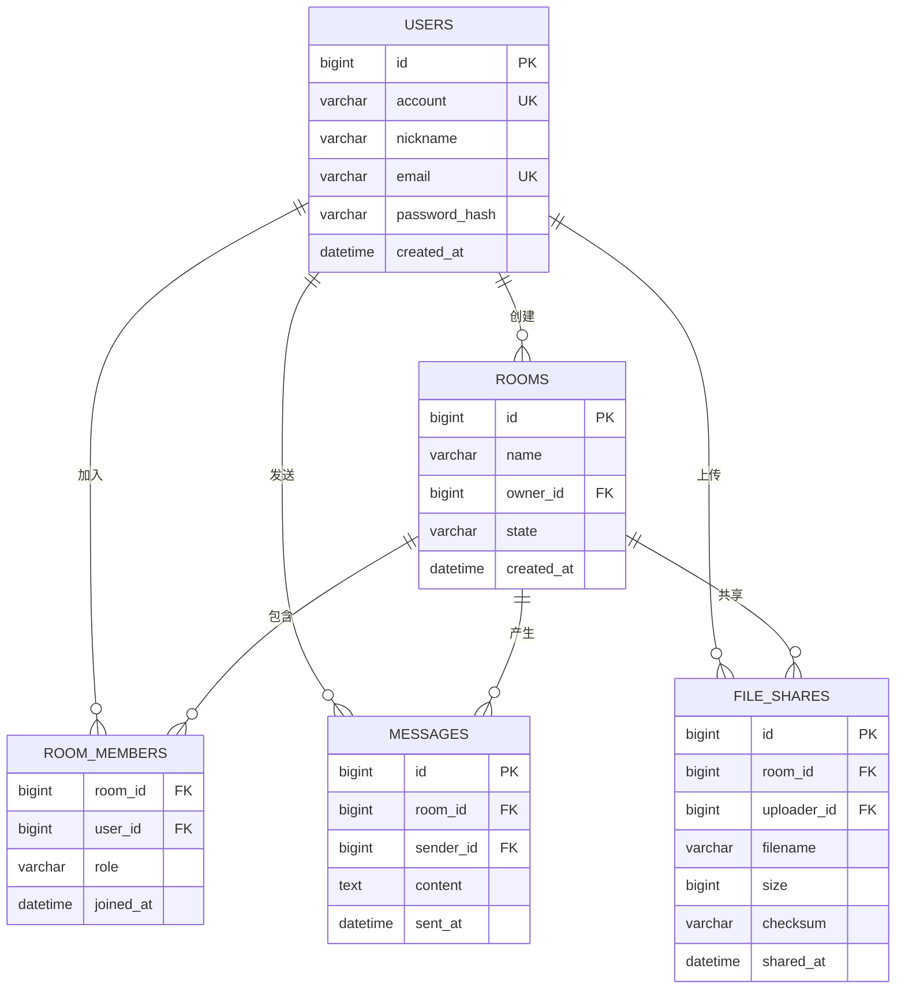

# PrismPlayer 项目计划书

> 项目负责人：@xiaofusu123 | 起书日期：2026.4.30
> 项目成员：@ambulance001、@Rikka2-aa、@RickeyDeung、@kuailede110
> 最后更新：2026-10-09
>
> **本文档分两部分**：§1–§10 是**计划**（原本要做什么），§11 是**当前状态**（磁盘上的代码实际做到了什么，逐项对着文件行数核过）。遇到「计划说已完成、§11 说没有」的矛盾，**以 §11 为准**。
>
> 状态标记：✅ 已落地 / 🟡 仅骨架 / 📐 仅设计 / ⛔ 未开始。术语以根目录 `GLOSSARY.md` 为准。

---

## 1. 项目概述

**项目名称**：PrismPlayer（棱镜播放器）

**项目内容**：开发一款跨平台音视频播放器，支持本地播放和联机同步播放。

**运行平台**：

| 端 | 平台 | 系统 |
|----|------|------|
| 客户端 | Windows x64 | 26H2 |
| 客户端 | Android | — |
| 客户端 | iOS | — |
| 服务端 | Linux | Ubuntu |

> **现状**：只有 Windows 被真正构建过（`build/` 下的产物全部是 Windows 目标）。Android / iOS 目前只有 Flutter 脚手架，没有任何构建记录（见 §11）。

---

## 2. 主要功能

| 模块 | 功能 |
|------|------|
| 本地播放 | 本地音乐播放 |
| 本地播放 | 本地视频播放 |
| 联机播放 | 一起听音乐 |
| 联机播放 | 一起看视频 |
| 社交 | 联机房间、聊天室 |
| 传输 | 音视频文件分享 |

---

## 3. 技术选型

| 类别 | 选型 | 版本 | 备注 |
|------|------|------|------|
| 数据库 (客户端) | SQLite | 3.x | **尚未声明依赖**，见 §4 |
| 数据库 (服务端) | MySQL | 8.x | **尚未声明依赖**，见 §4 |
| C 编译器 | Clang | C17 | 工具链根目录走机器级环境变量 `CLANG_ROOT` |
| C++ 编译器 | Clang++ | C++17 | 同上 |
| 构建系统 | Ninja | 1.13.2 | 实际是 `$env{CLANG_ROOT}/ninja.exe` |
| 构建语言 | CMake | 4.3.2 | `CMakePresets.json` 为 version 10 格式 |
| 前端语言 | Dart | 3.13.0 (3.13.0-77.0.dev) | `ui/pubspec.yaml` 要求 `sdk: ^3.12.1` |
| 前端 UI | Flutter | 3.44.0 (3.44.0-1.0.pre-326) | — |

> 括号里是 `项目计划书.docx`（2026-06-01 冻结的 Word 旧版）里的**完整版本串**，md 版当时只保留了主版本号。存档位置见 `docs/archive/`。
>
> **数据库两行目前只是计划**：`sqlite3` 与 MySQL 客户端都**没有**出现在 `vcpkg.json` 里，见 §4。

---

## 4. 第三方库

「状态」列的口径：

- **已使用** —— 有 `find_package`，且源码里真的 `#include` 了；
- **已接线未使用** —— CMake 里有 `find_package`，但**没有任何源码 `#include`**（拨了线但没通电）；
- **已声明未接线** —— 只在 `vcpkg.json` 里声明，CMake 里没有 `find_package`；
- **计划内未声明** —— 文档里写了要用，但 `vcpkg.json` 里根本没有。

| 类别 | 库 | 用途 | 状态 | 证据 |
|------|-----|------|------|------|
| 工具 | `spdlog` | 日志输出 | ✅ **已使用** | `find_package` 在 adapter/engine/service/av_sync/network 5 处；`#include <spdlog/spdlog.h>` 出现在 `client/service/src/Player.cpp:11`、`client/business/av_sync/src/CommandDispatcher.cpp:6`、`SyncAlgorithm.cpp:3`、`PlaybackStateMachine.cpp:3`、`EngineObserver.cpp:3` |
| 音视频 | `ffmpeg` | 解封装、编解码 | 🟡 已接线未使用 | `client/engine/CMakeLists.txt:5` `find_package(FFMPEG REQUIRED)`；`client/engine/src/` 下无任何 ffmpeg 源文件 |
| 音视频 | `soundtouch` | 音频变速变调 | 🟡 已接线未使用 | `client/engine/CMakeLists.txt:8` |
| 渲染 | `vulkan` | GPU 渲染管线 | 🟡 已接线未使用 | `client/engine/CMakeLists.txt:6` |
| 渲染 | `glfw3` | 跨平台窗口管理 | 🟡 已接线未使用 | `client/engine/CMakeLists.txt:7` |
| 网络 | `asio` | 异步网络 I/O | 🟡 已接线未使用 | `client/business/network/CMakeLists.txt:5` |
| 网络 | `ixwebsocket` | WebSocket 客户端 | 🟡 已接线未使用 | `client/business/network/CMakeLists.txt:7` |
| 数据 | `nlohmann-json` | JSON 解析 | 🟡 已接线未使用 | `client/business/network/CMakeLists.txt:6` |
| 渲染 | `glm` | 数学库 | 📐 已声明未接线 | `vcpkg.json` 的 `client` feature 里有，全仓无 `find_package` |
| 数据 | `openssl` | 加密/哈希 | 📐 已声明未接线 | 同上 |
| 工具 | `gtest` | 单元测试和集成测试 | 📐 已声明未接线 | `vcpkg.json` 的 `test` feature 里有，全仓无 `find_package(GTest)`、无 `add_test()` |
| 数据 | `sqlite3` | 本地数据库 | ⛔ **计划内未声明** | `vcpkg.json` 里**没有**这一项 |
| 音视频 | `libplacebo` | 视频后处理（计划） | ⛔ **计划内未声明** | `vcpkg.json` 里**没有**这一项，见 `docs/adr/0004-渲染与音频后端.md` |

> **「已接线未使用」这 7 个库正是当前构建失败的原因之一**：`client/engine/CMakeLists.txt` 要求 `FFMPEG` / `Vulkan` / `glfw3` / `soundtouch` 四个包必须找到，而本机 vcpkg 安装树里这些库文件已经丢失。修构建是 #51。

---

## 5. 架构分层

项目总体分为 **六层**：

```
1. 表示层 (UI)          — Flutter / Dart
2. FFI 桥接层           — Dart ↔ C++ 桥接（`ui/lib/ffi/`）【Flutter 项目内】
3. 服务层 (Service)      — C API 门面
4. 业务层 (Business)     — AV Sync + Network
5. 引擎层 (Engine)       — 音频/视频引擎（工厂模式）
6. 适配器层 (Adapter)    — 文件、数据库、网络、配置、加密
```

| 层 | 状态 | 依据 |
|---|---|---|
| 表示层 (UI) | 🟡 仅骨架 | `ui/` 是 Flutter 全平台脚手架，但 `ui/lib/main.dart` 仍是官方计数器模板 |
| FFI 桥接层 | 🟡 仅骨架 | `ui/lib/ffi/ffi_bridge.dart` 只有 17 行：`class FFIBridge { static DynamicLibrary loadLibrary() }`，**无 `lookupFunction`、无 typedef、无结构体映射、无 Isolate**，且 `ui/lib` 中无人 import 它 |
| 服务层 (Service) | ✅ 已落地 | `client/service/src/Player.cpp` **448 行**，`extern "C"` 位于 135–572 行，实现 **32 个** C API；头文件 `Player.h` 253 行、`Types.h` 125 行 |
| 业务层 (Business) | ✅ AV Sync 已落地 / ⛔ Network 占位 | AV Sync：`client/business/av_sync/src/` 5 个 `.cpp` 共 **323 行**；Network：`include/` 下 6 个头是真的，但 `internal/NetImpl.h` 与 `src/tmp.cpp` 都是 **0 字节** —— 状态统一写「占位（接口已定义，无实现）」 |
| 引擎层 (Engine) | 🟡 仅骨架 | 只有 4 个 `.cpp` 共 **75 行**（`AudioEngineWasapiShared.cpp` 29 + 工厂 7 + `VideoEngineVulkan.cpp` 32 + 工厂 7），**无任何 FFmpeg / 真实 WASAPI / 真实 Vulkan 代码** |
| 适配器层 (Adapter) | 🟡 仅骨架 | `include/` 5 个抽象接口头 + `internal/` 5 个平台实现头，全部只有声明骨架（含 `// TODO` 注释），`src/tmp.cpp` 是 **0 字节** |

> ⚠️ **原文这里把引擎层标成「最完善层」，这个标签是错的。** 引擎层的实际代码量（75 行）比业务层的 AV Sync（323 行）少一个数量级，比服务层（448 行）少近六倍。真正最完善的是**服务层**。此说法源自更早的设计预期，已按实测修正。

---

## 6. 人员分工

> 仓库是 **PUBLIC**，因此成员一律用 GitHub 登录名标识，不使用真名。

| 成员 | 负责模块 | 说明 |
|------|----------|------|
| @xiaofusu123 | 整体架构设计、项目骨架与初始框架搭建（根提交 `68cc4cf`）、Engine 层（音视频解码）、**Server 端**、**构建与基线**、文档与规范 | 项目负责人 |
| @RickeyDeung | Service 层、Business 层 AV Sync 模块 | 服务门面 + 音视频同步 |
| @ambulance001 | Business 层 Network 模块 | 实时通信、文件传输 |
| @kuailede110 | UI 层 (Flutter) | 界面设计与交互（已退出本仓库协作，见下注） |
| @Rikka2-aa | 数据库设计、Adapter 层 | 数据持久化 |

> `@kuailede110` 已退出本仓库的协作，但其负责的 UI 层分工不变；GitHub 上仍保留其协作者权限（尚未移除）。

---

## 7. 项目文件结构

以下为**按实际仓库重新生成**的树（只列 git 跟踪的内容；`ui/` 只列到源码层）：

```
PrismPlayer/
├── client/                        # 客户端
│   ├── common/                    # 公共头文件
│   │   ├── API.h                  # _API 导出宏
│   │   └── pch.h                  # 预编译头（0 字节）
│   ├── adapter/                   # 适配器层（静态库 client-adapter）
│   │   ├── include/               # 抽象接口：ConfigAdapter / CryptoAdapter /
│   │   │                          #           DBAdapter / FileAdapter / NetworkAdapter
│   │   ├── internal/              # 平台实现：JSONConfigAdapter / OpenSSLCryptoAdapter /
│   │   │                          #           SQLiteDBAdapter / WinFileAdapter / ASIONetworkAdapter
│   │   └── src/                   # tmp.cpp（0 字节，模块内唯一的 .cpp）
│   ├── business/                  # 业务层
│   │   ├── av_sync/               # AV Sync（静态库 client-av_sync）★ 有真实实现
│   │   │   ├── include/           # ICommandDispatcher / IEngineObserver /
│   │   │   │                      # IPlaybackStateMachine / ISyncAlgorithm /
│   │   │   │                      # SyncFactory / SyncTypes
│   │   │   ├── internal/          # CommandDispatcher / EngineObserver /
│   │   │   │                      # PlaybackStateMachine / SyncAlgorithm
│   │   │   └── src/               # 5 个 .cpp，共 323 行
│   │   └── network/               # Network（静态库 client-network）※ 占位
│   │       ├── include/           # IAccountManager / INetworkObserver / IRoomManager /
│   │       │                      # ISignalingClient / NetworkFactory / NetworkTypes
│   │       ├── internal/          # NetImpl.h（0 字节）
│   │       └── src/               # tmp.cpp（0 字节）
│   ├── engine/                    # 引擎层（动态库 client-engine）※ 仅骨架
│   │   ├── include/               # AudioEngine / AudioEngineFactory /
│   │   │                          # AudioEngineWasapiSharedFactory / VideoEngine /
│   │   │                          # VideoEngineFactory / VideoEngineVulkanFactory
│   │   ├── internal/              # AudioEngineWasapiShared / VideoEngineVulkan
│   │   └── src/                   # 4 个 .cpp，共 75 行
│   └── service/                   # 服务层（动态库 client-service）★ 有真实实现
│       ├── include/               # Player.h（32 个 C API）、Types.h
│       ├── internal/              # IServiceNetwork.h、PlayerImpl.h
│       └── src/                   # Player.cpp（448 行）
│
├── ui/                            # Flutter 项目（含 FFI 桥接）
│   ├── lib/main.dart              # 官方计数器模板，尚未替换
│   ├── lib/ffi/ffi_bridge.dart    # 17 行的动态库加载占位
│   └── {android,ios,linux,macos,web,windows}/
│
├── server/                        # 服务端（可执行文件 Prism-server）
│   ├── adapter/  business/  network/   # 各层只有 tmp.h / tmp.cpp，全部 0 字节
│   └── main.cpp                   # 3 行：int main(){ return 0; }
│
├── vendor/                        # 自定义 C++ 库
│   ├── threadpool/                # ★ 有真实实现（ThreadPool.h 87 行 + .cpp 109 行）
│   │   ├── test/                  # benchmark_test / load_test / stress_test（各 ~100 行）
│   │   └── 测试报告.md
│   └── memorypool/                # 空壳：src/MemoryPool.cpp 0 字节，待删除
│
├── test/                          # 单元测试（目录为空，见 §11）
├── docs/
│   ├── markdown/                  # ★ 唯一真源：6 份文档
│   ├── adr/                       # 架构决策记录（5 篇）
│   ├── agents/                    # Agent 技能配置（issue-tracker / triage-labels / domain）
│   ├── archive/                   # 已过时的 Word 旧版（只读）
│   └── (txt/ 已于本次修订删除：2 份 ASCII-art 旧版，实测零独有信息，见 ADR 0003)
├── practice/                      # 试验代码（被 .gitignore 忽略，不在版本控制与构建中）
├── build/                         # 构建输出（被忽略）
├── CMakeLists.txt                 # 根 CMake（只 add_subdirectory client 与 server）
├── CMakePresets.json              # CMake 预设（windows-base / -Debug / -Release）
├── vcpkg.json                     # vcpkg 依赖清单（features: client / server / test）
├── vcpkg-configuration.json       # baseline 固定
├── .clangd                        # LSP 提示（不是 .clang-format，门禁尚未建立）
├── build.bat / build.sh           # 构建脚本（build.sh 是空壳，见 #51）
└── AGENTS.md                      # Agent 协作说明
```

> 与旧版树的差异（旧版把计划画成了现实）：
> - 旧版画了 `test/` 但没说它是空的 —— 现在标出来。
> - 旧版写 `client/ (动态库)`，实际 `client` 不是一个目标，而是 5 个 `client-*` 目标，形态各不相同（见 `docs/adr/0001-分层架构与库形态.md`）。
> - 旧版把 `vendor/modelpool`、`practice/`、`build/`、`docs/` 与 `client/` 画成平级工程内容，但根 `CMakeLists.txt` 里**只有** `client` 与 `server` 被 `add_subdirectory`。
> - `docs/` 现已细分 `markdown`（真源）/ `adr` / `agents` / `archive`；原来的 `docs/txt/`（2 份 ASCII-art 旧版）已删除 —— 逐节比对确认它相对 md 零独有信息，字节数更大只是等轴填充空格所致，理由见 `docs/adr/0003-文档真源.md`。

---

## 8. 开发阶段规划

状态列的含义同 §11；「依据」列给出判定所依据的具体文件或行数。

### 阶段一：基础设施搭建

| 项 | 状态 | 依据 |
|---|---|---|
| 项目骨架搭建（CMake + vcpkg） | ✅ | 根 `CMakeLists.txt`、`vcpkg.json`、`CMakePresets.json` 均在 |
| Engine 层抽象接口设计 | ✅ | `client/engine/include/` 6 个头（AudioEngine / VideoEngine / 两个工厂等） |
| 构建系统配置（Ninja + Clang） | ✅ | `CMakePresets.json` version 10，hidden `windows-base` + Debug/Release |
| Vendor 库（ThreadPool + MemoryPool） | 🟡 | ThreadPool 是真实现（87+109 行）；MemoryPool 是空壳（`src/MemoryPool.cpp` 0 字节、`MemoryPool.h` 只有 5 行且命名空间写成 `ThreadPool`），已决定删除 |

> ⚠️ 「构建系统配置 ✅」是**配置存在**的意思，不是「构建能用」。当前构建是坏的：vcpkg 安装树里只剩 `asio`，其余库的头与库文件均已丢失；`build.sh` 是 5 行空壳、无任何 cmake 调用；`build.bat` 的非法输入分支把预设名写成了 `windows-clang-x64-Releasee`。修复见 #51。

### 阶段二：Engine 层实现

| 项 | 状态 | 依据 |
|---|---|---|
| WASAPI 共享模式音频引擎骨架 | ✅ | `client/engine/src/AudioEngineWasapiShared.cpp`（29 行）+ 工厂（7 行） |
| Vulkan 视频引擎骨架 | ✅ | `client/engine/src/VideoEngineVulkan.cpp`（32 行）+ 工厂（7 行） |
| FFmpeg 集成与解封装模块 | ⛔ | `client/engine/src/` 下**没有任何 FFmpeg 相关源文件** |
| 音频解码器实现 | ⛔ | 无源文件；仅有 `practice/AudioDecoder.h`（117 行纯设计稿，且**未被 git 跟踪**） |
| 视频解码器实现 | ⛔ | 无源文件 |
| SoundTouch 变速集成 | ⛔ | 无源文件 |
| Vulkan 渲染管线完成 | ⛔ | `VideoEngineVulkan.cpp` 32 行，无初始化、无交换链、无纹理上传 |

### 阶段三：业务层实现

| 项 | 状态 | 依据 |
|---|---|---|
| AV Sync 同步算法 | ✅ | `SyncAlgorithm.cpp` 47 行（`drift = video_pts - audio_pts`，超 `ahead_threshold_ms` → `WAIT`、低于 `-behind_threshold_ms` → `DROP`、否则 `RENDER`） |
| 播放状态机 | ✅ | `PlaybackStateMachine.cpp` 65 行 |
| 命令分发与引擎观察者 | ✅ | `CommandDispatcher.cpp` 130 行 + `EngineObserver.cpp` 58 行；`SyncFactory.cpp` 23 行 |
| WebSocket 信令客户端 | ⛔ 占位（接口已定义，无实现） | `ISignalingClient.h`（40 行）有声明，`internal/NetImpl.h` 与 `src/tmp.cpp` 均 0 字节 |
| 房间管理 | ⛔ 占位 | `IRoomManager.h`（42 行）同上 |
| 账号认证 | ⛔ 占位 | `IAccountManager.h`（39 行）同上 |

### 阶段四：Service + FFI 层

| 项 | 状态 | 依据 |
|---|---|---|
| Service 层 C API 门面 | ✅ | `Player.h` 里 `_API` 出现 **32** 次；`Player.cpp` 里 32 个定义（原文此处写「27个API」，已修正） |
| Service 层内部实现 | ✅ | `PlayerImpl.h` 58 行 + `IServiceNetwork.h` 51 行（网络侧当前是默认桩实现） |
| Flutter 项目脚手架初始化 | ✅ | `ui/` 全平台脚手架 + `pubspec.yaml`（`ffi: ^2.0.0`、`audioplayers: ^5.0.1`） |
| Flutter UI 框架搭建 | ⛔ | `ui/lib/main.dart` 仍是官方计数器模板；`ui/lib/gui/tmp.dart` 0 字节 |

### 阶段五：UI + Server

| 项 | 状态 | 依据 |
|---|---|---|
| Server `internal/` 目录迁移（命名统一） | 🟡 | 目录确实叫 `internal/`，但里面只有 0 字节的 `tmp.h`；且 `server/{adapter,business,network}/` 的 CMake 文件名**仍是小写 `CmakeLists.txt`**（在 Ubuntu 上会导致 `add_subdirectory` 失败） |
| Flutter 播放器界面 | ⛔ | 未开始 |
| 房间列表与聊天界面 | ⛔ | 未开始 |
| Server 端 WebSocket 服务 | ⛔ | `server/main.cpp` 只有 3 行 |
| 用户认证与房间管理后端 | ⛔ | `server/` 下零行非空 C++ 逻辑 |

### 阶段六：联调与测试

| 项 | 状态 | 依据 |
|---|---|---|
| 端到端播放测试 | ⛔ | 未开始 |
| 多客户端同步播放测试 | ⛔ | 未开始 |
| 单元测试覆盖率达标 (80%+) | ⛔ | `test/` 目录**为空**；70 个旧测试在 `f9ddd15`（2026-06-03）被整体删除（781 行）；`build/Testing/20260608-0204/Test.xml` 显示最后一次 ctest 跑了 **0 个**测试 |
| 性能优化与 Bug 修复 | ⛔ | 未开始 |

---

## 9. 数据库设计概要

> **本节的表都是「计划」**：客户端 SQLite 的 `sqlite3` 依赖未声明，服务端 MySQL 的客户端依赖也不存在；`client/adapter/internal/SQLiteDBAdapter.h:40` 还留着 `// TODO: 添加 sqlite3* 数据库句柄等私有成员`。

### 9.1 客户端 (SQLite)

**账号表**

| 字段 | 说明 |
|------|------|
| 账号名 | 昵称 |
| 邮箱 | 登录凭证 |
| 密码 | 哈希存储（SHA-256 + Salt，见 `docs/adr/0004-渲染与音频后端.md` 相关的安全设计） |

**音频文件表**

| 字段 | 说明 |
|------|------|
| 歌曲名 | 文件标题 |
| 文件路径 | 本地路径 |
| 文件大小 | 字节数 |
| 封面图片 | 专辑封面路径 |
| 作曲家 | 作者信息 |
| 音频编码格式 | AAC/MP3/FLAC/Opus/PCM |
| 时长 | 毫秒 |
| 采样格式（位深） | 16/24/32 bit |
| 采样频率 | 44100/48000/96000/192000 Hz |
| 比特率（码率） | bps |
| 声道数 | 1/2/6/8 |
| 声道布局 | 单声道/立体声/5.1/7.1 |
| 歌词文件路径 | LRC 文件 |

**视频文件表**

| 字段 | 说明 |
|------|------|
| 文件名 | 文件标题 |
| 文件路径 | 本地路径 |
| 文件大小 | 字节数 |
| 视频作者 | 导演/作者 |
| 分辨率 | 宽x高 |
| 色深 | 8/10 bit |
| 时长 | 毫秒 |
| 视频编码格式 | H.264/H.265/AV1/VP9 |
| 帧率 | fps |
| 比特率 | bps |

**设置表**

| 字段 | 说明 |
|------|------|
| 键 / 值 | 用户偏好设置（键值对） |

### 9.2 服务端 (MySQL)

- 用户表（集中认证）
- 房间表（房间状态）
- 消息表（聊天记录）
- 文件分享记录表

### 9.3 E-R 图

> **这一条要求原先只在 `项目计划书.docx` 里**（原文：「（3）主要内容：数据库的设计和查询SQL语句的优化，给出数据库的E-R图」）。md 版在重写时把它丢了，现在补回来。

**服务端（MySQL）**：



**客户端（SQLite）**：四张表（账号、音频文件、视频文件、设置）是**单机本地表，彼此之间不设外键** —— 媒体文件表不做「属于哪个账号」的归属，因为本地库天然只属于本机用户。这一点与上面服务端的关系模型不同，实现时不要照搬。

### 9.4 查询 SQL 语句的优化要求

> 同样来自 `项目计划书.docx`，md 版重写时丢失。

服务端 MySQL 的查询至少要满足：

1. **高频查询走索引**：`ROOM_MEMBERS(room_id, user_id)` 建**联合唯一索引**（同时作为「是否已在房间内」的判据）；`MESSAGES(room_id, sent_at)` 建联合索引，支撑「拉取房间最近 N 条消息」；
2. **避免 N+1**：房间列表页需要「房间 + 成员数 + 房主昵称」，用一次 `JOIN` + `GROUP BY` 取回，不要每行再查一次；
3. **避开 `SELECT *`**：列表查询只取需要的列，`content`（`TEXT`）不进列表页；
4. **分页用键集分页（keyset pagination）**：消息列表按 `sent_at` 游标翻页，不用 `LIMIT offset`（大房间下 offset 会线性变慢）；
5. **写路径**：房间状态变更用事务包住「更新房间 + 写成员表」，避免房主掉线时留下半截状态。

`EXPLAIN` 是验收手段：上述每条查询的 `type` 不得出现 `ALL`（全表扫）。

---

## 10. 里程碑

| 时间 | 里程碑 | 状态 | 备注 |
|------|--------|------|------|
| 2026.4.30 | 项目启动，架构设计 | ✅ 完成 | 首提交 `68cc4cf` |
| 2026.5.10 | 项目骨架搭建（CMake + vcpkg） | ✅ 完成 | — |
| 2026.5.22 | 分层目录创建，Engine 接口定义 | ✅ 完成 | — |
| 2026.5.30 | Engine 层工厂模式 + WASAPI/Vulkan 骨架 | ✅ 完成 | 即当前 75 行的全部内容 |
| TBD | Engine 层解码实现 | ⛔ 未开始 | 见 §8 阶段二 |
| 2026.6.4 | AV Sync 模块完整实现（4 个子系统） | ✅ 完成 | 323 行，今天仍然是全仓第二大实现 |
| TBD | Service 层完整实现（**32 个** C API） | ✅ 完成 | 原文写「27个C API」，已修正；`Player.cpp` 448 行 |
| 2026.6.x | Flutter 项目初始化 | ✅ 完成 | 只到脚手架，UI 未搭 |
| TBD | 联调与测试 | ⛔ 未开始 | 见 §8 阶段六 |

> **进度停滞提示**：最后一次提交是 `c3bcf0b`（2026-07-15，`vendor/` 下的线程池），距今约 3 个月；`client/`、`server/`、`test/`、`ui/`、`docs/` 的最后一次改动都在 2026-06 中旬之前，**2026-08 起零提交**。里程碑表里的 TBD 因此暂时没有新的时间锚点。

---

## 11. 当前状态（实测）

> 本节是**对磁盘代码的实测记录**，判定日期 2026-10-09，基准提交是当时的 `core-xiaofusu`（`c3bcf0b`）。它与 §1–§10 的「计划」冲突时，以本节为准。

### 11.1 一句话结论

**文档系统性超前于代码。** 真正有实现的只有三处：`client/business/av_sync/`（323 行）、`client/service/src/Player.cpp`（448 行）、`vendor/threadpool/`（196 行 + 306 行测试）。其余各层要么是 0 字节文件，要么只有声明骨架。

### 11.2 编译产物印证

| 产物 | 大小 | 含义 |
|---|---|---|
| `build/client/business/av_sync/libclient-av_sync.a` | 1,087,194 B | 含真实目标文件 |
| `build/client/engine/libclient-engine.dll` | 192,000 B | 有内容（骨架） |
| `build/client/service/libclient-service.dll` | 1,013,248 B | 有内容 |
| `build/server/Prism-server.exe` | 85,504 B | 有内容（只有 3 行 main） |
| `build/client/adapter/libclient-adapter.a` | **832 B** | **空归档**（ar 头 + 符号表，无任何 `.o`） |
| `build/client/business/network/libclient-network.a` | **832 B** | **空归档** |
| `build/server/{adapter,business,network}/libserver-*.a` | **832 B** | **空归档** |

Flutter 侧**无任何构建产物**。

### 11.3 空壳与 0 字节文件清单

| 位置 | 情况 |
|---|---|
| `client/common/pch.h` | 0 字节 |
| `client/adapter/src/tmp.cpp` | 0 字节（该模块唯一的 `.cpp`） |
| `client/adapter/include/*.h`、`internal/*.h` | 只有类声明骨架（`OpenSSLCryptoAdapter.h:36`、`SQLiteDBAdapter.h:40` 有 `// TODO`） |
| `client/business/network/internal/NetImpl.h`、`src/tmp.cpp` | 0 字节 |
| `client/engine/src/` | 4 个文件共 75 行，无解码实现 |
| `server/main.cpp` | 3 行 |
| `server/{adapter,business,network}/**` | 全部 0 字节 + `CmakeLists.txt`（小写 m） |
| `vendor/memorypool/src/MemoryPool.cpp` | 0 字节；`MemoryPool.h` 5 行且命名空间写成 `ThreadPool` |
| `practice/pcm_player.cpp` | 0 字节；整个 `practice/` 未被 git 跟踪 |
| `ui/lib/gui/tmp.dart` | 0 字节 |
| `test/` | 目录为空（70 个旧测试在 `f9ddd15` 被删） |

### 11.4 门禁与测试

全部缺失：无 `.clang-format`、无 `.clang-tidy`、无 `.editorconfig`、无 `.githooks/`、无 `.pre-commit-config.yaml`、无 `.github/`、无任何 CI 配置。仓库里唯一的工具配置文件是 `.clangd`（LSP 提示，不是格式化门禁）。规则集与落地方式见 `docs/adr/0002-代码门禁.md`，落地票 #50。

### 11.5 已知的文档 ↔ 代码不一致（本文档已修正的除外）

其余各文档的同类问题由 #46（`项目框架.md`）、#47（`数据流.md`、`API接口文档.md`）分别处理，不在本节重复。
